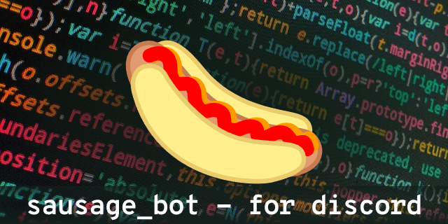

SausageBot - affectionately known as "pølsa" among its Norwegian users - is a Discord bot with some very specific functions.

## Functions

### Administration (main)

- Kick/ban users (/kick, /ban)
- Set language (/language)
- Show active tasks (/tasks)
- Make the bot talk (/say, right-click message to edit already posted message)

### Autoevent
Takes links to soccer games on predefined sites, and make them into an event for the server.

Command: `/autoevent`

- Add, remove or list events
- Create a sync timer for a live event on TV/stream so everyone watching on their own is more or less in sync
- Announce an event in a specific channel

### Dilemmas
Create dilemmas for discussion on the server

Command: `/dilemmas`

- Add dilemma
- Post dilemma
- Count no. of dilemmas

### Log Maintenance
Manage logging settings. How many days of logs to keep, or how big the log files should be.

Command: `/log_maintenance`

- Start and stop log maintenance
- List available settings
- Change settings

### Poll
Make a simple poll.

Command: `/poll`

- Make a poll

### Quote
Save and post quotes from the server.

Command: `/quote`

- Add a quote
- Edit a quote
- Delete a quote
- Count no. of quote
- List quote from quote number or search for a keyword

### Roles
Manage roles and reaction messages.
Can autoadd role for new users.

Command: `/roles`

#### Roles
- Add roles to server
- Remove roles to server
- Edit a role
- Show info about a role
- List roles or emojis

#### Reaction messages
- Add reaction message
- Remove reaction message
- List reaction messages
- Sort reaction messages
- Sync reaction messages
- Add roles to reaction messages
- Remove roles from reaction messages

#### Settings
Settings for roles and reaction messages on the server
- Set a unique role for new users. This is great if you want a certain role to be added to new users to separate them when it comes to moderation or restriction in permissions.
- Chose roles not to be included when deciding if the unique role is a user's only role or not.

### RSS
Post RSS-feeds to a channel, both normal RSS-feeds and podcasts from Spotify.

Command: `/rss`

- Start, stop and restart posting of feeds
- Add a RSS feed
- Remove a RSS feed
- Edit a RSS feed's settings

- List all active rss feeds
- Add an allow-/deny-filter for a RSS feed
- Remove an allow-/deny-filter from a RSS feed
- List all RSS feeds: normal, added by or filter

### Scrape FCB
(A very specific cog for one of my servers)
Scrape the football website https://www.fcbarcelona.com and post news from the website to specific team channels.
Autposting news to specific channels: `first-team`, `femení`, `atlètic`, `juvenil` and `club`.

### Stats
Get stats to post in a stats channel. Can post stats about the codebase, roles and their members.

Command: `/stats`

- Start, stop and restart posting of stats
- Add setting
- Remove setting
- Change setting
- List settings
- Hide roles from stats

### Youtube
Post new videos from given Youtube channels

Command: `/youtube`

- Start and stop posting of videos
- Add a youtube channel for posting
- Remove a youtube channel
- Add an allow-/deny-filter for a youtube channel
- Remove an allow-/deny-filter from a youtube channel
- List all youtube channels: normal, added by or filter

## Set up

Ok, so you want to run a Discord bot?

### Register Discord bot

Follow the instructions on this page on *Creating a Discord Bot Account*: https://www.pythondiscord.com/pages/guides/python-guides/discordpy/#creating-a-discord-bot-account
- Navigate to https://discord.com/developers/applications and log in.
- Click on New Application.
- Enter the application's name.
- Click on Bot on the left side settings menu.
- Click "Add Bot" and confirm with "Yes, do it!".
- Give your bot a cool name and a nice icon.
- Activate all the intents under "Bot" -> "Privileged Gateway Intents" and click "Save Changes". **Important** Read up on what the specific intents do before you activate them

### Want Spotify branding on your podcast-feeds?

You need to register with Spotify API first:

- Follow the instructions on this page on *Getting started*: https://developer.spotify.com/documentation/web-api
- Add "Client ID" and "Client secret" in .env file or as environment argument in docker

### Running the bot

#### Docker-compose

Use the [docker-compose file](https://github.com/geirawsm/sausage_bot/blob/main/docker-compose.yml).

#### Running locally with python

It is recommended to run the bot in a controlled environment, by using `pipenv` or similar services.

- Using the terminal, navigate to the folder where you want to install the bot
- Run `git clone https://github.com/geirawsm/sausage_bot.git`
- `cd` into sausage_bot
- Install `pipenv` if you haven't already
- Run `pipenv shell` to create the python environment and start the shell
- Run `pipenv install` to install dependencies
- Run the bot once to get the `.env` file: `python -m sausage_bot`
- Open `sausage_bot/sausage_bot/data/.env` and add as a minimum these values under the `basic` key:
    - `DISCORD_TOKEN`   Get the token from the [Discord Developer portal](https://discord.com/developers/applications) under "Bot", "Build-A-Bot", "TOKEN"
    - `DISCORD_GUILD`   The name of the discord server you want to connect to
    - `BOT_ID`          Also found in the [Discord Developer portal](https://discord.com/developers/applications), under "OAuth2", "General", "Client information", "CLIENT ID"
- Invite the bot to your discord server:
    - Again, go back to the [Discord Developer portal](https://discord.com/developers/applications), "OAuth2", "URL Generator".
    - Chose the scope "bot"
    - Chose the minimum needed permission for the bot. Only chose "Administrator" if you're absolutely sure.
    - Click "Copy" on "Generated url", visit that link in a browser.
    - Make sure that the information looks correct, select the server you want it to join, and click "Continue" and confirm the permissions by clicking "Authorize". Your bot should now join the channel in a disconnected state.
- Start the bot
    - Go back to the terminal and run `python -m sausage_bot` again. The bot will now be online.

If you run `python -m sausage_bot -h` you can also see all the arguments you can add.

#### Build docker image

`docker build .`

`docker run sausage_bot:latest -v [host path to a data folder]:/data`

---

# Want to contribute?

Here's how to help out:

- Report bugs in issues.

- Come up with awesome ideas (and submit them in issues)

- Make pull requests that solves a problem or an issue
